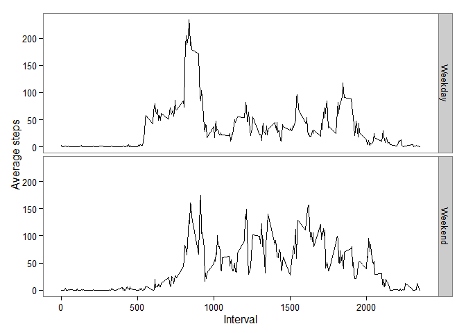

# Reproducible Research: Peer Assessment 1
Zaixing Shi, 07/16/2015  


## Loading and preprocessing the data

First thing first, load the data

```r
act <- read.csv("activity.csv",header=T)
```

Now let's check the data


```r
str(act)
```

```
## 'data.frame':	17568 obs. of  3 variables:
##  $ steps   : int  NA NA NA NA NA NA NA NA NA NA ...
##  $ date    : Factor w/ 61 levels "2012-10-01","2012-10-02",..: 1 1 1 1 1 1 1 1 1 1 ...
##  $ interval: int  0 5 10 15 20 25 30 35 40 45 ...
```

```r
head(act,10)
```

```
##    steps       date interval
## 1     NA 2012-10-01        0
## 2     NA 2012-10-01        5
## 3     NA 2012-10-01       10
## 4     NA 2012-10-01       15
## 5     NA 2012-10-01       20
## 6     NA 2012-10-01       25
## 7     NA 2012-10-01       30
## 8     NA 2012-10-01       35
## 9     NA 2012-10-01       40
## 10    NA 2012-10-01       45
```


Note that variable date was not a date vector, so let's convert it into date 
format

```r
act$date <- as.Date(as.character(act$date))
```

Check to see it's current format

```r
class(act$date)
```

```
## [1] "Date"
```


## What is mean total number of steps taken per day?

Take a look at the distribution of total number of steps taken each day

```r
hist(tapply(act$steps,act$date,sum,na.rm=T),xlab="total number of steps",
     main="Histogram of daily total steps")
```

 

To get a better sense of the distribution of daily steps, let's look at the 
mean and median of daily total steps

```r
c(Mean=mean(tapply(act$steps,act$date,sum,na.rm=T)),
  Median=median(tapply(act$steps,act$date,sum,na.rm=T)))
```

```
##     Mean   Median 
##  9354.23 10395.00
```

So on average the sample walked 9354 steps each day, and half of the sample
walked more than 10395 steps daily. Who are these energetic people? 


## What is the average daily activity pattern?

To answer this question, we should get the average steps across all dates

```r
mean_int_steps <- tapply(act$steps,act$interval,mean,na.rm=T)
```
Then the average number of steps during every 5-minute interval were like this:


```r
plot(x=names(mean_int_steps),y=mean_int_steps,type="l",
     xlab="Intervals",ylab="Average steps",
     main="Average steps for each interval")
```

 

In this plot, the Empire State of Steps occured at the interval of... 

```r
names(mean_int_steps[mean_int_steps==max(mean_int_steps)])
```

```
## [1] "835"
```

That is, on average our sample walked most frequenly during the five-minute interval
between 8:35-8:40 -- probably the morning rush hour? 

## Imputing missing values
To learn how many missing values were present:

```r
nrow(act[which(is.na(act$steps)),])
```

```
## [1] 2304
```

So 2304 intervals in our data had missing steps. A huge problem!

To make educated guesses about these missing steps, I make this bold statement
that "All missing steps were created equal"" -- that is, all steps at a given 
interval should be the same.  Therefore we will fill in the missing steps using
the average step at that particiular interval.


```r
act.fill <- act
act.fill$steps[is.na(act.fill$steps)] <- lapply(names(mean_int_steps),function(x) 
 act$step[act.fill$interval==x & is.na(act.fill$step)] <- 
   mean_int_steps[names(mean_int_steps)==x])
```

The dataset act.fill is the clone of dataset act but with missing steps filled 
in. To see if the fill in was successful:

```r
head(act)
```

```
##   steps       date interval
## 1    NA 2012-10-01        0
## 2    NA 2012-10-01        5
## 3    NA 2012-10-01       10
## 4    NA 2012-10-01       15
## 5    NA 2012-10-01       20
## 6    NA 2012-10-01       25
```

```r
head(act.fill)
```

```
##       steps       date interval
## 1  1.716981 2012-10-01        0
## 2 0.3396226 2012-10-01        5
## 3 0.1320755 2012-10-01       10
## 4 0.1509434 2012-10-01       15
## 5 0.0754717 2012-10-01       20
## 6   2.09434 2012-10-01       25
```

To make the histogram of daily total steps, let's round up the filled in steps
and then plot.


```r
act.fill$steps <- round(as.numeric(act.fill$steps))
hist(tapply(act.fill$steps,act.fill$date,sum,na.rm=T),
     xlab="total number of steps",
     main="Histogram of daily total steps")
```

 

And here are the comparisons between our means and medians before and after
filling in missing steps:

```r
c(Mean.before=mean(tapply(act$steps,act$date,sum,na.rm=T)),
  Mean.after=mean(tapply(act.fill$steps,act.fill$date,sum,na.rm=T)),
  Median.before=median(tapply(act$steps,act$date,sum,na.rm=T)),
  Median.after=median(tapply(act.fill$steps,act.fill$date,sum,na.rm=T)))
```

```
##   Mean.before    Mean.after Median.before  Median.after 
##       9354.23      10765.64      10395.00      10762.00
```

So apparently, filling in the missing steps will increase the mean and median,
which makes perfect sense as in pervious calculation we excluded missing values.

To make formal comparisons between the original and imputed steps, let's do
a t-test of the means:

```r
t.test(tapply(act$steps,act$date,sum,na.rm=T),
       tapply(act.fill$steps,act.fill$date,sum,na.rm=T))
```

```
## 
## 	Welch Two Sample t-test
## 
## data:  tapply(act$steps, act$date, sum, na.rm = T) and tapply(act.fill$steps, act.fill$date, sum, na.rm = T)
## t = -1.6429, df = 110.2, p-value = 0.1032
## alternative hypothesis: true difference in means is not equal to 0
## 95 percent confidence interval:
##  -3113.8778   291.0581
## sample estimates:
## mean of x mean of y 
##   9354.23  10765.64
```

So the imputation increased the mean, but not caused significant increase to 
the daily total steps (p-value for t-test = 0.1032).

## Are there differences in activity patterns between weekdays and weekends?
Create a factor variable indicating weekday or weekend:

```r
act$weekdays <- ifelse(weekdays(act$date) %in% c("Saturday","Sunday"),
                       "Weekend","Weekday")
```
To check if we correctly coded the weekday/weekend:

```r
table(weekdays(act$date),act$weekdays)
```

```
##            
##             Weekday Weekend
##   Friday       2592       0
##   Monday       2592       0
##   Saturday        0    2304
##   Sunday          0    2304
##   Thursday     2592       0
##   Tuesday      2592       0
##   Wednesday    2592       0
```
Looks cool!

Now let's plot the time series by weekday and weekend. 
We started with making a summary data of the average steps for weekdays and 
weekends.

```r
suppressWarnings(mean_int_steps_wd <- data.frame(do.call(rbind,
  lapply(c("Weekday","Weekend"),function(x) {
  mean_steps <- tapply(act[which(act$weekdays==x),"steps"],
                       act[which(act$weekdays==x),"interval"],mean,na.rm=T)
  return(cbind(interval=row.names(mean_steps),mean_steps,group=x))
  }))))

# conver factor to numeric for plotting
mean_int_steps_wd[,1:2] <- lapply(mean_int_steps_wd[,1:2], function(f)
                            as.numeric(levels(f))[f])
```

Then we plot the avergae steps for each interval by weekday/weekend. This is 
done with the package "ggplot2".


```r
library(ggplot2)
ggplot(mean_int_steps_wd,aes(x=interval,y=mean_steps))+
  geom_line()+
  facet_grid(group~.)+
  labs(y="Average steps",x="Interval")+
  theme_bw()+
  theme(panel.grid=element_blank())
```

 

So it appears that our sample tend to be more active during the weekend - instead
of the bi-modal walking pattern observed during weekedays, sample walked more
evenly and more frequently during weekends.  

We can further compare the mean steps for each intervals between weekdays and
weekend.


```r
t.test(tapply(act[which(act$weekdays=="Weekday"),"steps"],
                       act[which(act$weekdays=="Weekday"),"interval"],
              mean,na.rm=T),
       tapply(act[which(act$weekdays=="Weekend"),"steps"],
                       act[which(act$weekdays=="Weekend"),"interval"],
              mean,na.rm=T),
       paired=T)
```

```
## 
## 	Paired t-test
## 
## data:  tapply(act[which(act$weekdays == "Weekday"), "steps"], act[which(act$weekdays ==  and tapply(act[which(act$weekdays == "Weekend"), "steps"], act[which(act$weekdays ==     "Weekday"), "interval"], mean, na.rm = T) and     "Weekend"), "interval"], mean, na.rm = T)
## t = -3.142, df = 287, p-value = 0.001853
## alternative hypothesis: true difference in means is not equal to 0
## 95 percent confidence interval:
##  -12.589301  -2.891519
## sample estimates:
## mean of the differences 
##                -7.74041
```

Compared with their performance during weekdays, our sample walked about 8 
more steps in every 5-minute intervals during weekend. 
And this difference is statistically significant (P=0.001853).

I'm so glad they had a chance to relax[^1] after a whole week of work!

[^1]: Relax - the status of walking more hours than working.  


